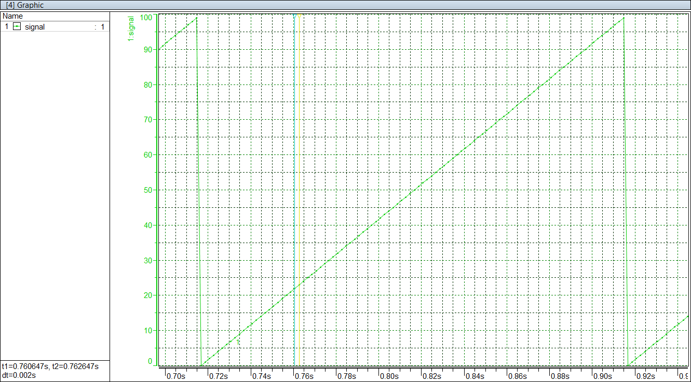

# Implementation of XCPonEthernet for communication between CANape and Xilinx Zynq-7000 ZedBoard
## Description
This project gives example codes to connect between Xilinx Zynq-7000 Zedboard and CANape using XCPonEthernet. The communication is implemented in both bare-metal and FreeRTOS. Users should be able to further develop applications and use CANape for online measurement and calibration via XCPonEthernet based on the provided projects. The transport layer protocol is UDP; TCP is not fully achieved yet. 

## Platform
### Hardware
- ZedBoard Zynq-7000 ARM/FPGA SoC Development Board. More information is available here: [ZedBoard Zynq-7000](https://www.xilinx.com/products/boards-and-kits/1-elhabt.html.html). 
### Software
- Vivado 2018.2
- Xilinx SDK 2018.2

## File Structure
- Folder CANape_standalone
    - This folder contains a CANape project used by the XCPonEthernet application in bare-metal.
    - The contents of this project are the same as those in CANape_freertos. The only difference is the location of .elf file.
- Folder CANape_freertos
    - This folder contains a CANape project used by the XCPonEthernet application in FreeRTOS.
    - The contents of this project are the same as those in CANape_standalone. The only difference is the location of .elf file.
- Folder XCPonEthernet
    - This folder contains the whole project of XCPonEthernet in bare-metal including Vivado project (although the FPGA part is not used) and programs in SDK. The code only shows how to communicate using XCPonEthernet. 
- Folder XCPonEthernet_FreeRTOS
    - This folder contains the whole project of XCPonEthernet in FreeRTOS including Vivado project (GPIOs in PL are used for lighting PL LEDs) and programs in SDK. Besides the communication using XCPonEthernet, the code also shows how to initialize the GPIOs in PS and PL to light LEDs.

## Result
A variable named "signal" which varies from 0 to 99 is measured in CANape. The "signal" value changed for every 2ms.

## Reference
1. Xilinx Video: ["Networking with lwip Focused on FreeRTOS"](http://www.xilinx.com/video/soc/networking-with-lwip-focused-free-rtos.html)
2. [Xilinx Standalone Library Documentation - OS and Libraries Document Collection](https://www.xilinx.com/support/documentation/sw_manuals/xilinx2019_1/oslib_rm.pdf)
3. (Xilinx) [LightWeight IP Application Examples](https://www.xilinx.com/support/documentation/application_notes/xapp1026.pdf)
4. Official website: [Vector | XCP](https://www.vector.com/int/en/know-how/protocols/xcp-measurement-and-calibration-protocol/)
5. [XCP Sample Implementation 1.30.5](https://www.vector.com/int/en/download/?tx_vectorproducts_productdownloaddetail%5Bdownload%5D=3652&tx_vectorproducts_productdownloaddetail%5Baction%5D=show&tx_vectorproducts_productdownloaddetail%5Bcontroller%5D=Productdownload&cHash=9745a0d6fe49b9622ce1f77936e9a337)
6. [XCP – The Standard Protocol for ECU Development](https://assets.vector.com/cms/content/application-areas/ecu-calibration/xcp/XCP_ReferenceBook_V3.0_EN.pdf)
